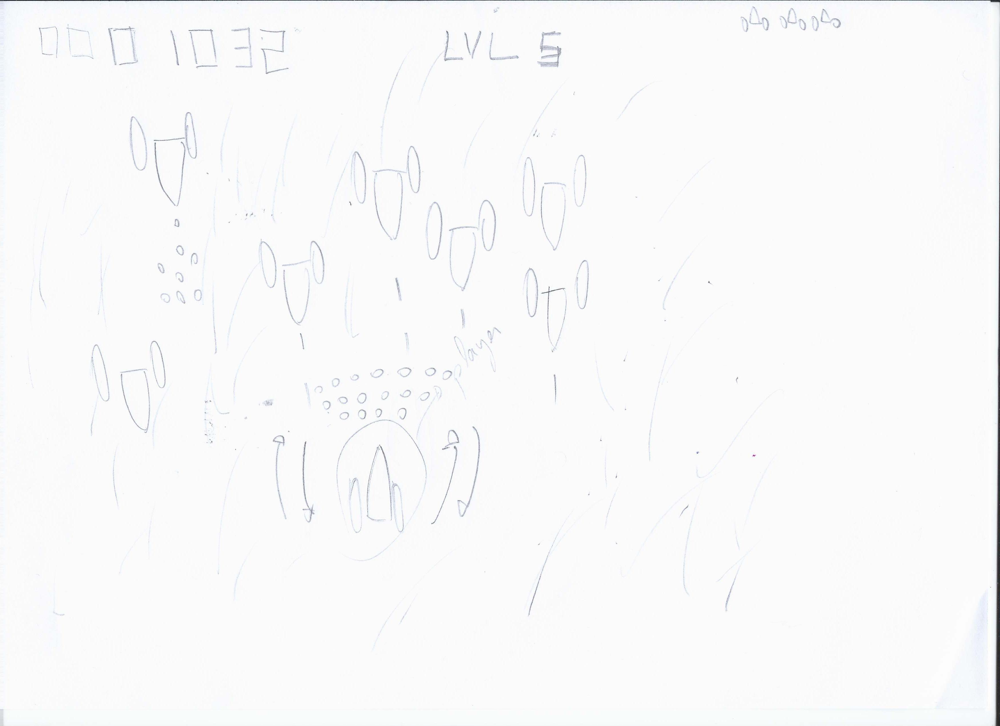
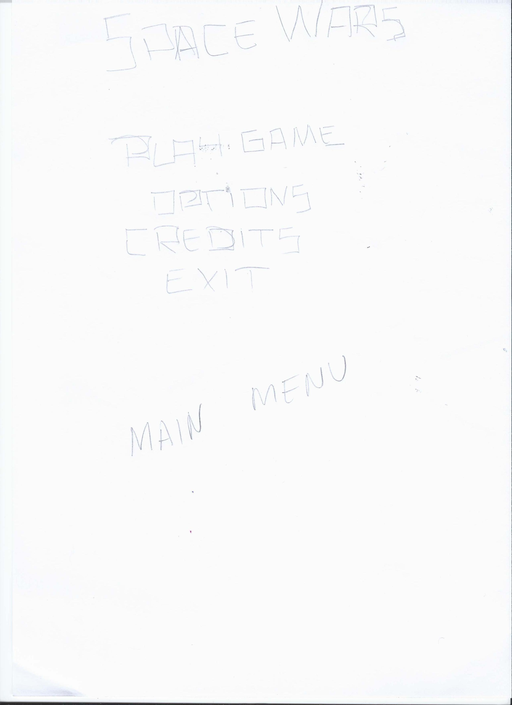

#Game Concept
---

###SpaceWars

###Plataforma
Linux

###Jogadores
1 Jogador

###Gênero
Tiro

###High Concept
O jogo tem como objetivo a destruição dos inimigos no cenario assim como alcançar o ponto final da fase sem colidir com nenhum objeto ou ser acertado por um tiro das naves inimigas.

###Objetivo
Chegar ate o final da fase sem ser atingido por tiros ou colidir com outros objetos.

###Recursos
Baseado no estilo [Space Invaders](http://en.wikipedia.org/wiki/Space_Invaders), o jogo possuiu um cenceito simples e objetivo: A destruição da frota inimiga. Para tal o jogador deve, alem de disparar inumeros tiros contra os inimigos, evitar ser alvejado por disparos vindos do computador. Há também a necessidade de se evitar a colisão com objetos que se pode encontrar no espaço.

###Conceitos iniciais do jogo

Conceito inicial sobre uma parte jogável

Conceito inicial sobre menu

